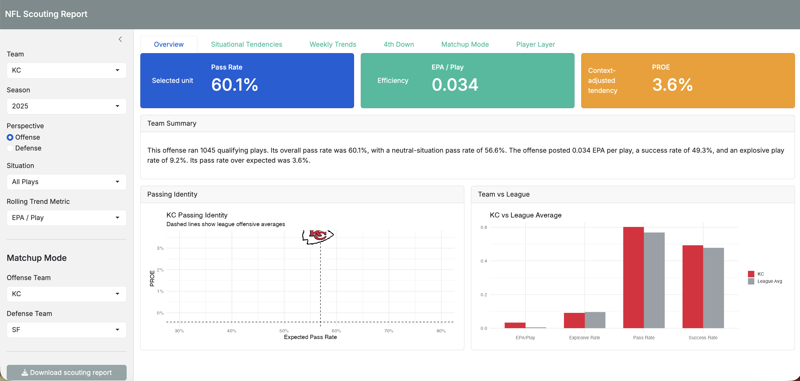
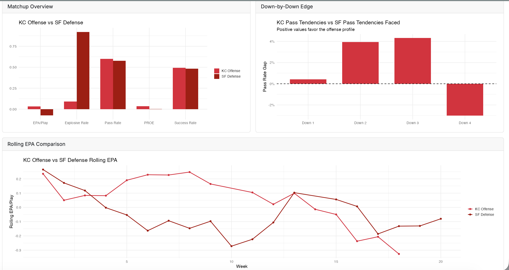
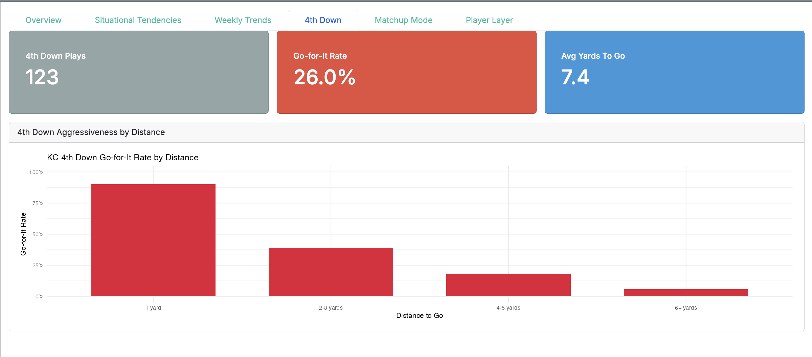
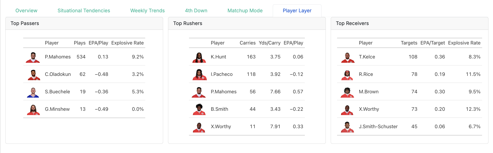

# NFL Scouting Report App

## Project Purpose
This project was built to demonstrate the ability to create a full end-to-end sports analytics product, including data engineering, modeling, visualization, and application development. The app simulates a real-world scouting workflow used by football analysts.

## Overview
An interactive Shiny app that generates customizable NFL scouting reports using play-by-play data.

## Features
- Offensive and defensive team profiles
- Situational filtering (red zone, 3rd down, etc.)
- Matchup mode (offense vs defense)
- 4th down decision analysis
- Player-level breakdowns with headshots
- Downloadable HTML scouting reports

## Tools Used
- R (tidyverse)
- Shiny / bslib
- nflreadr / nflplotR
- gt (tables)
- Quarto (report generation)

## Screenshots

### Overview Dashboard


### Matchup Mode


### 4th Down Analysis


### Player Layer


<p align="center">
  
</p>

## Example Scouting Report

You can view a sample generated scouting report here:

[Download Sample Report](docs/sample_report.html)

## How to Run
```r
source("R/00_packages.R")
source("R/data_prep.R")
build_scouting_data(seasons = 2023:2025)

source("R/player_data_prep.R")
build_player_summaries()

shiny::runApp()
```

